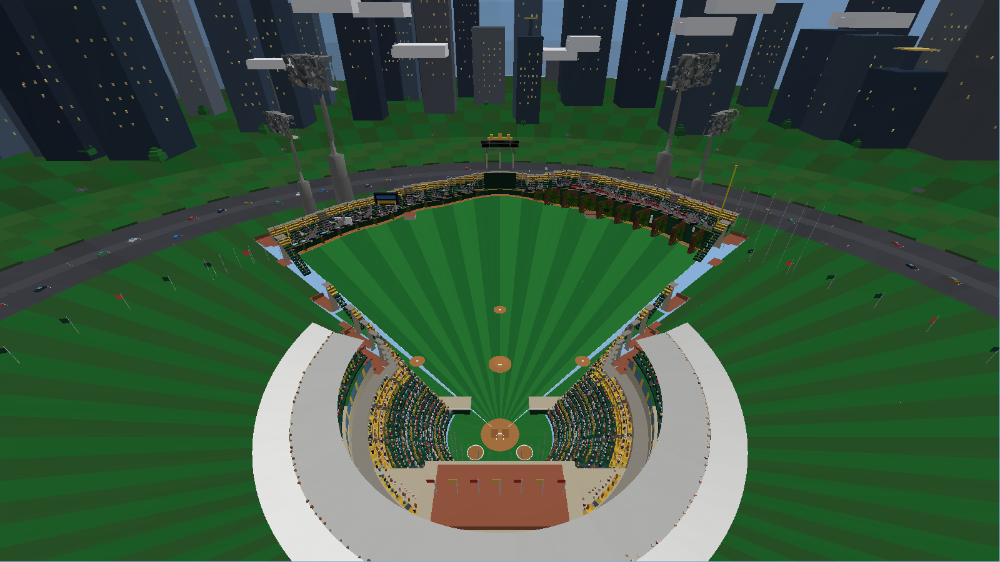
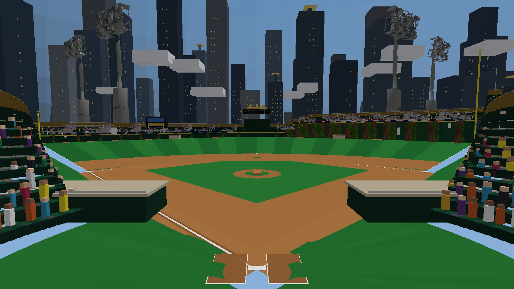
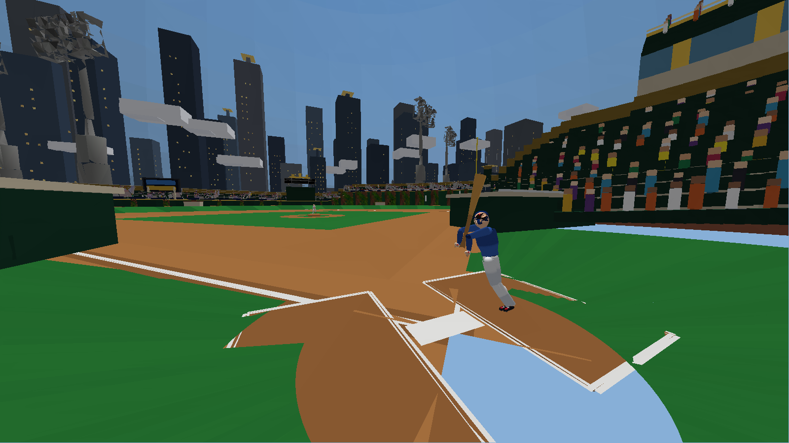
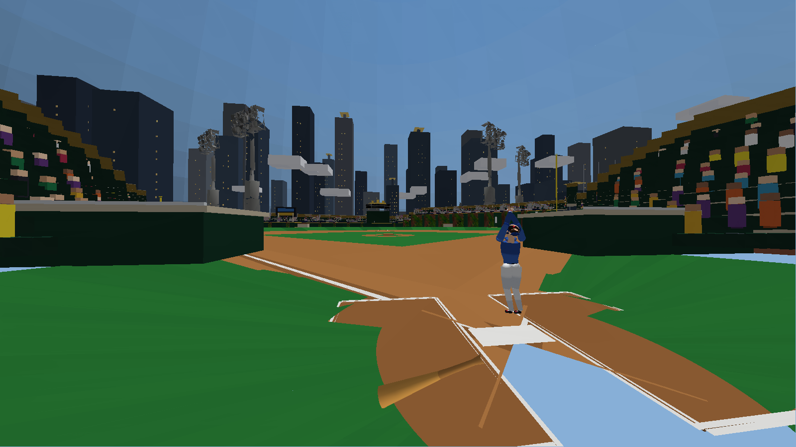

# Dinger Derby

A home-run-derby baseball game built on a custom C++20 software/GL engine with
SFML 3. Fully procedural stadium, skinned characters, and animation — no game
engine, no assets required beyond a couple of optional props.

Highlights:

- **Crown Jewel ballpark** — forest-green bowl, suite ring, cantilevered roof,
  brick rotunda, gold crown videoboard, and a downtown skyline behind center
  field
- **Skinned characters** — procedurally built batter / pitcher / catcher with
  role uniforms, plus authored clips (windup, stance, swing, receive,
  celebrations)
- **Real hit physics** — PCI aiming, exit-velocity classes, fence collision,
  derby scoring with career bests

## Screenshots

Rendered headlessly by the engine's own software rasterizer
(`screenshot_capture`, run it from the project root after building):









## Controls (bat_physics_demo)

| Input | Action |
| --- | --- |
| Mouse | Aim reticle (PCI) |
| Space / LMB | Swing |
| Z / X / C | Power / Contact / Regular swing |
| D / P / L | Derby / Practice / Live at-bat |
| 1 / 2 / 3 | Easy / Normal / Hard (Hard unlocks with 3+ HR on Normal) |
| R | Next pitch |
| N | New derby round |
| H | Help overlay |
| - / = | Bat crack volume |
| Esc | Quit |

## Building on Windows (MinGW + SFML 3 + C++20)

Prerequisites:

1. **MinGW-w64 GCC 13+** (developed on WinLibs GCC 16, UCRT POSIX SEH).
2. **SFML 3.0.x** built for the same MinGW (e.g. via
   [vcpkg](https://vcpkg.io) with the `x64-mingw-dynamic` triplet).
3. **CMake + Ninja** (the WinLibs bundle ships both).

Configure and build:

```bash
cmake -S dinger-derby -B dinger-derby/build -G Ninja \
  -DCMAKE_BUILD_TYPE=Release \
  -DCMAKE_PREFIX_PATH="C:/path/to/vcpkg/installed/x64-mingw-dynamic"
cmake --build dinger-derby/build
```

Run the tests:

```bash
ctest --test-dir dinger-derby/build --output-on-failure
```

Play:

```text
dinger-derby\build\bat_physics_demo.exe   # the main game
dinger-derby\build\demo_launcher.exe      # menu of all demos
dinger-derby\build\character_viewer_demo.exe
dinger-derby\build\stadium_demo.exe
```

The executables need the SFML and MinGW runtime DLLs next to them (or on
`PATH`): copy `sfml-*.dll` from your SFML `bin` directory plus
`libgcc_s_seh-1.dll`, `libstdc++-6.dll`, and `libwinpthread-1.dll` from your
MinGW `bin` directory into `dinger-derby/build/`.
